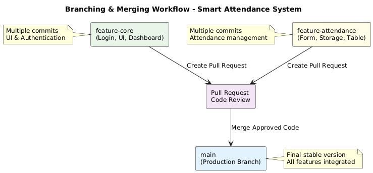
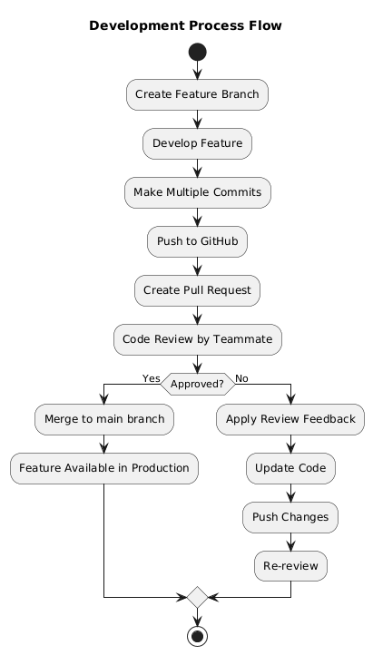
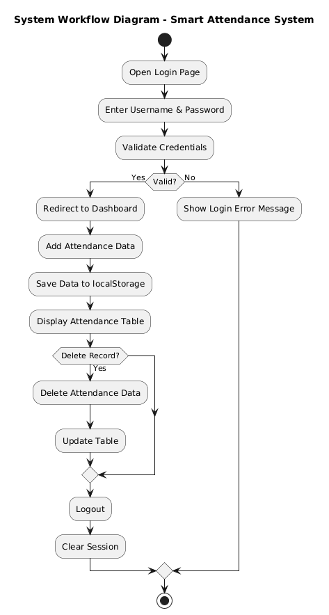

# smart-attendance-system

## 📌 Project Overview
Smart Attendance System is a simple web-based application developed as a Final Exam Group Project for the Software Engineering course.

This project demonstrates the implementation of Git version control and collaborative development using GitHub.  
The system allows users to log in and manage student attendance records through a clean and modern user interface.

---

## 👥 Team Members

1. **Alfarid Ridwan (60%)**
   - Login Page
   - Modern UI Styling
   - Login Validation
   - Dashboard Layout
   - Logout System

2. **Susi Septiyani Febrian (40%)**
   - Attendance Form
   - Save Data using localStorage
   - Display Attendance Table
   - Delete Attendance Record

> Contribution percentages are based on feature responsibility and commit history.

---

## 🚀 Features

### 🔐 Authentication
- Login using username and password
- Session validation using localStorage
- Logout functionality
- Login error notification using toast message

### 📝 Attendance Management
- Add student attendance (Name & Status)
- Automatically save attendance data using localStorage
- Display attendance list in a dynamic table
- Delete attendance records
- Attendance data persists during browser session

---

## 🛠 Technologies Used
- HTML5  
- CSS3  
- JavaScript (Vanilla JS)  
- LocalStorage  
- Git & GitHub  

---

## 🔄 Git Workflow

This project applies proper Git collaboration practices:

- Separate feature branches:
  - `feature-core`
  - `feature-attendance`
- Minimum three meaningful commits per member
- Pull Requests for merging features
- Code review before merging
- All code merged into the `main` branch

This workflow ensures code quality, traceability, and collaboration discipline.

---

## 📂 Project Structure

smart-attendance-system/
│
├── index.html # Login page
├── register.html # Register page
├── dashboard.html # Dashboard & attendance page
├── style.css # Global styling
├── login.js # Login & register logic
├── attendance.js # Attendance logic
└── README.md

## 🔑 Default Login Credentials

> For development and testing purposes only.

Users can register a new account through the **Register page**.  
All registered users are stored locally using **localStorage**.

---

## 🧠 System Workflow

1. User opens the login page (`index.html`)
2. User enters valid credentials
3. System validates login using JavaScript
4. If valid → redirect to dashboard
5. User adds attendance data
6. Data saved to localStorage
7. Attendance list displayed dynamically
8. User can delete attendance records
9. User can logout to end session

---

## 🎯 Project Objectives

This project aims to:
- Apply Software Engineering concepts in a practical scenario
- Demonstrate Git version control usage
- Practice collaborative development using GitHub
- Implement branching and pull request workflow
- Develop a clean and functional web application
- Improve teamwork and communication in software development

---

## ✅ Project Status

✔ Authentication system implemented  
✔ Registration system implemented  
✔ Attendance management system implemented  
✔ Modern responsive UI applied  
✔ Git branching strategy applied  
✔ Pull requests and code reviews completed  
✔ All features successfully merged into `main` branch  

---

## 📎 Repository Link

🔗 https://github.com/alfarid-rdwn/smart-attendance-system.git

---

## 🔄 Git Workflow Diagram

### 1️⃣ Branching & Merging Flow

### 2️⃣ Development Process Flow

### 3️⃣ System Workflow Diagram

---

## 📌 Notes
This application is designed for **educational purposes** and local testing only.  
No backend or database server is used in this version.

